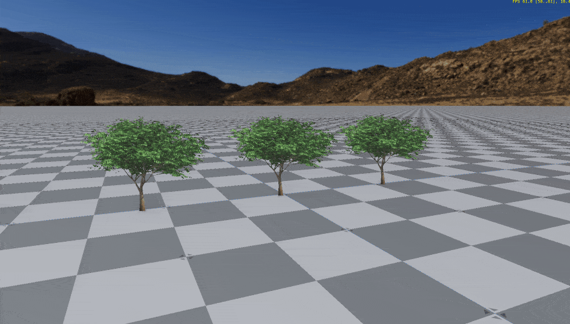
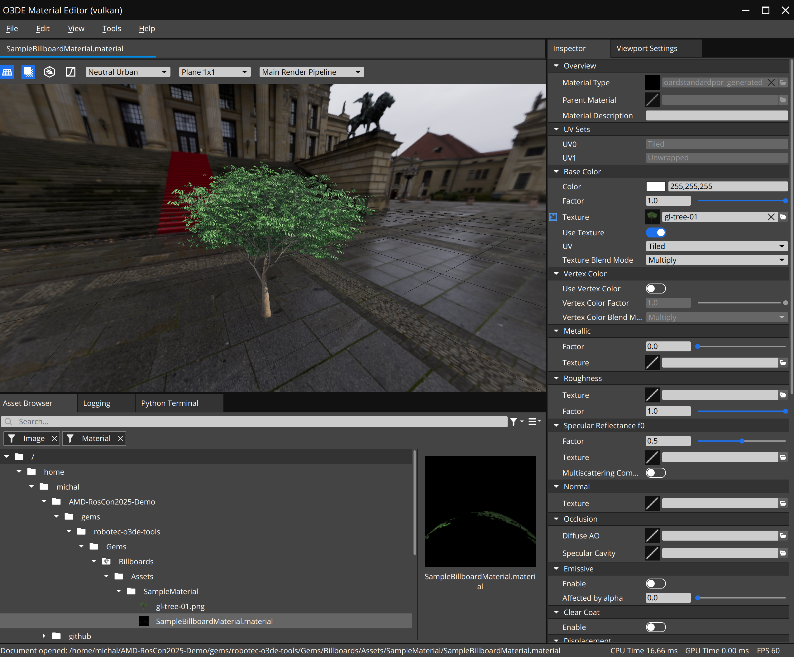

# Billboards in O3DE


A Standard PBR implementation that makes a mesh always face the camera. 
It is usefull to be used as last LOD for vegetation:
- reduce number of vertices to be drawn
- can be used with cutout and without opacity
- reduce alliasing when rendering far-away vegetation

# Usage

You can create new material using material type in O3DE material editor.



> [!IMPORTANT]
> Receiving and casting shadows does not work. 

# Porting to newer version of the O3DE.

This gem contains a lot of code copied from Atom Gem. Lest break down files and changes that I've made to enable the conversion:


# `Assets/BillboardStandardPBR/BillboardOpacityPropertyGroup.json`

Original file : `o3de/Gems/Atom/Feature/Common/Assets/Materials/Types/MaterialInputs/OpacityPropertyGroup.json`
Changes:
 - Set `Opacity Mode` by default to `Cutout`

# `Assets/BillboardStandardPBR/BillboardCommonPropertyGroup.json`

Original file : `o3de/Gems/Atom/Feature/Common/Assets/Materials/Types/MaterialInputs/CommonPropertyGroup.json`
Changes:
 - Disable `Cast Shadows`
 - Disable `Receive Shadows`
# `Assets/BillboardStandardPBR/BillboardStandardPBR.materialtype`

Original file : `o3de/Gems/Atom/Feature/Common/Assets/Materials/Types/StandardPBR.materialtype`
Changes:
- Add `@gemroot:Atom_Feature_Common@/` to reference JSONs from Atom gem
- Reference custom `BillboardOpacityPropertyGroup.json` and `BillboardCommonPropertyGroup.json`

# `Assets/BillboardStandardPBR/BillboardStandardPBR.azsli`

Original file `StandardPBR.azsli`
Changes:
```diff
+    #include "BillboardBasePBR_VertexEval.azsli"
-    #include <Atom/Feature/Common/Assets/Shaders/Materials/BasePBR/BasePBR_VertexEval.azsli>
```

# `Assets/BillboardStandardPBR/BillboardBasePBR_VertexEval.azsli`

Original file `StandardPBR_VertexEval.azsli`
Changes:
- include `GetFacingUser.azsli`
```diff
-    output.position = mul(ViewSrg::m_viewProjectionMatrix, worldPosition);
+    output.position = GetFacingUser(objectToWorld, position);
```

# `Assets/BillboardStandardPBR/BillboardStandardPBR_Defines.azsli

Original file `StandardPBR_Defines.azsli`
Changes:
- add : `#define MATERIAL_USES_VERTEX_POSITIONWS 0`

