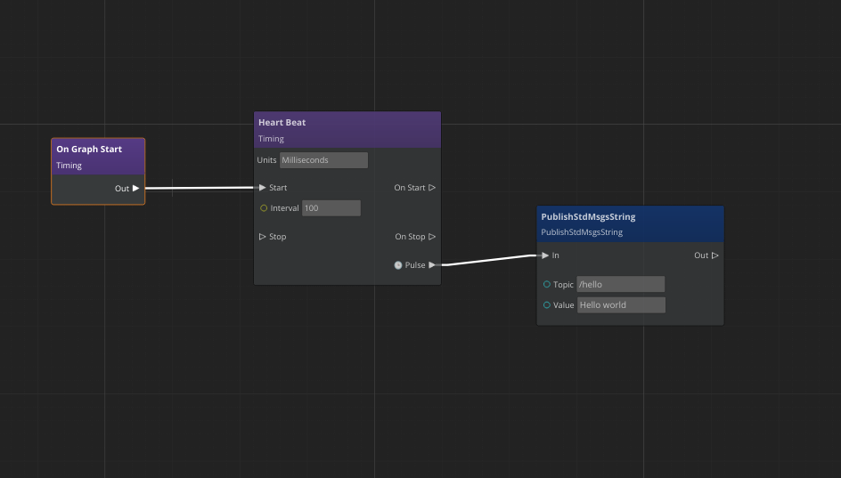
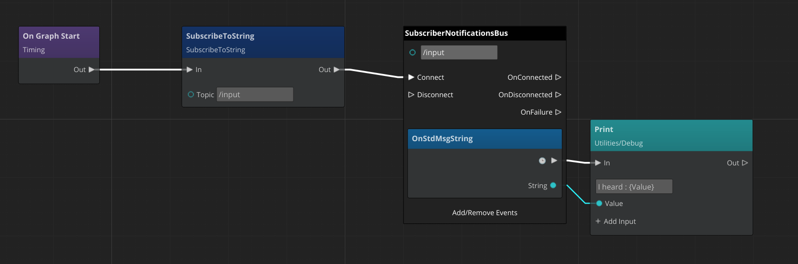

# ROS2ScriptIntegration

This tool Gem enables integration between ROS 2 Gem and ScriptCanvas or LUA scripting language.
It allows publishing or subscribing to a few types of messages using only scripting.
It has limited capability in comparison to the native ROS 2 API provided by ROS 2 Gem.
However, it is simple and fun to use and requires no C++ code.

Currently, the supported message types are limited to the following:
- a subset of geometry messages
- a subset of standard messages
- joystick message

## Hello world publisher

### ScriptCanvas Example

Let us write a simple publisher using Script Canvas.
1. Create a new entity.
2. Add a Script Canvas component to the entity
3. Develop a new script canvas:


**Explanation:**
The "OnGraphStart" node is called on the component being activated. 
It activates a "Heart Beat" node.
The "Heart Beat" node is configured to issue a pulse every 100 milliseconds.
Finally, pulse cause the publication message by node `PublishStdMsgsString`.

**Note** that the publisher is initialized on the first pulse.
To see your messages, start the simulation and type in the terminal:
```bash
ros2 topic echo /hello
```
You should see new messages arriving with a frequency of 10 Hertz.

### LUA Scripting Example

The message can be published from LUA scripting language using a single call:
```lua
PublisherRequestBus.Broadcast.PublishStdMsgsString("/hello", "Hello world from Lua")
```
in which the first parameter is a topic name and the rest of the parameters form the message (only one string in `PublishStdMsgsString` method).

## Subscriber

### ScriptCanvas Example

Let us subscribe to the string message topic from ROS 2. 
1. Create a new entity.
2. Add Script Canvas component to the entity
3. Develop a new script canvas:


**Explanation:**
The "OnGraphStart" node is called on the component being activated. 
It activates a 'SubscribeToString` node, which triggers the subscription to a topic with the given name.
Next, the Event Handler for `SubscriberNotificationBus` is activated. It generates a pulse and exposes received data on its input.

To send a message to the ROS 2 system copy the following line to the terminal:
```
ros2 topic pub /input std_msgs/String "data: 'testing 1 2 3'"
```

In the O3DE Editor console (or GameLauncher ImGui console) you should see:
```
(Script) - I heard : testing 1 2 3
```

### LUA Scripting Example

Similar to _ScriptCanvas_ example, receiving a message via ROS 2 topic requires two steps: a subscription to a _notification bus_ and an implementation of the _handler_. 
Please find the code snippet below, in which the subscription happens in the class activation and the handler is implemented as a method override.
```lua
function myscript:OnActivate()
	self.ros2BusHandler = SubscriberNotificationsBus.Connect(self, /input)
	SubscriberRequestBus.Broadcast.SubscribeToString("/input")
end

function myscript:OnStdMsgString(message)
    Debug.Log("I heard : " .. message)
end
```
