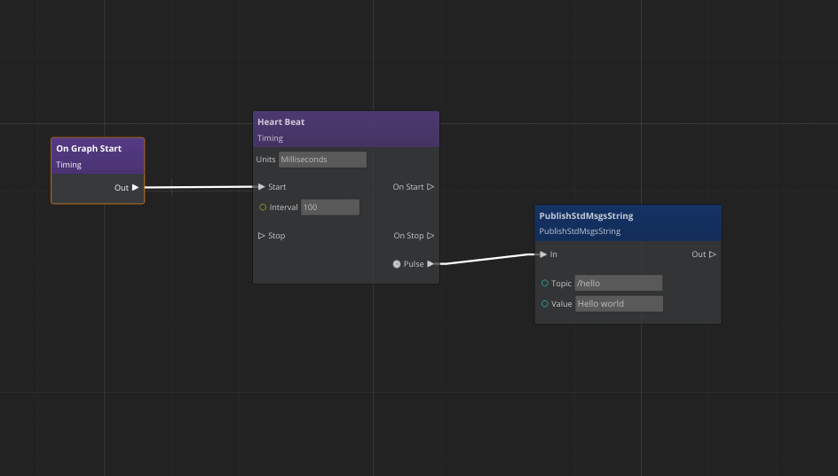
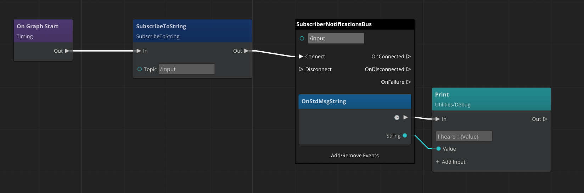

# ROS2ScriptIntegration

This tool gem allows users to integrate ROS 2 Gem with LUA or ScriptCanvas.
At this moment it allows publishing or subscribing to a few types of messages using only scripting.
It has limited capability in comparison to the native ROS 2 API provided by ROS 2 Gem.
Hover is simple and fun to use and requires no C++ code.

## Example

### Hello world publisher

Let us write a simple publisher using Script Canvas.
1. Create a new entity.
2. Add Script Canvas component to the entity
3. Develop a new script canvas :


**Explanation:**
The "OnGraphStart" node is called on the component being activated. 
It activates a "Heart Beat" node.
The "Heart Beat" node is configured to issue a pulse every 100 milliseconds.
Finally, pulse cause the publication message by node "PublishStdMsgsString".

**Note** that the publisher is initialized on the first pulse.
To see your messages, start the simulation and type in the terminal:
```bash
ros2 topic echo /hello
```
You should new messages coming with a frequency of 10 Hertz.


### Subscriber

Let us subscribe to the string message topic from ROS 2. 
1. Create a new entity.
2. Add Script Canvas component to the entity
3. Develop a new script canvas :


**Explanation:**
The "OnGraphStart" node is called on the component being activated. 
It activates a 'SubscribeToString` node. That triggers to subscribe to a topic with a given name.
Next Event Handler for `SubscriberNotificationBus` is activated. 
It generates a pulse and exposes received data on its input.


To send message to the ROS 2 system :
```
ros2 topic pub /input std_msgs/String "data: 'testing 1 2 3'"
```

In the O3DE Editor console (or GameLauncer ImGui console) you should see:
```
(Script) - I heard : test 1 2 3
```

Currently, there is a limited number of message types supported:
- a subset of geometry messages
- a subset of standard messages
- joystick message