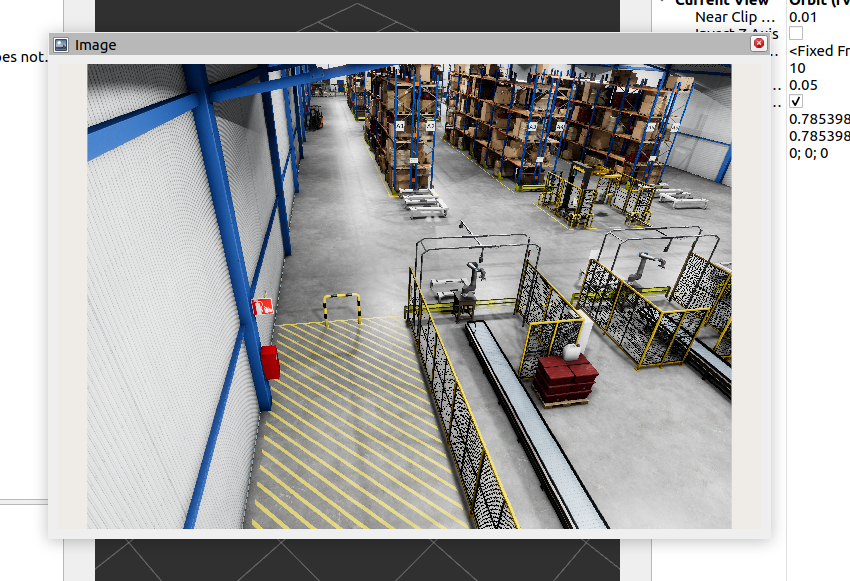

## Viewport Streamer Gem

This Gem provides a publisher, which streams application's current viewport on ROS2 topic.

## Features

This Gem publishes data on `sensor_msgs::msg::Image` ROS2 topic. Such data contain entire frame displayed in application's current viewport. 

## Prerequisites

- `o3de` project
- [ROS2 Gem](https://github.com/o3de/o3de-extras/tree/development/Gems/ROS2)

## Integration

Since `ViewportStreamer` works as a System Component, it is enabled in runtime without configuration from Editor. Default `/viewport` topic may be changed using SettingsRegistry.

## Interaction

Frames streamed on `/viewport` might be displayed e.g. using `rviz2`:

## SettingsRegistry usage

| Key name                             | Value type      | Default value            |
| ------------------------------------ | --------------- | ------------------------ |
| `/ViewportStreamer/StreamFrequency`  | `AZ::u64`       | 30                       |
| `/ViewportStreamer/FrameName`        | `AZStd::string` | "viewportstreamer_frame" |
