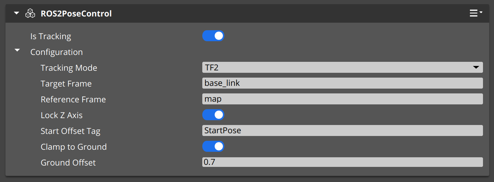
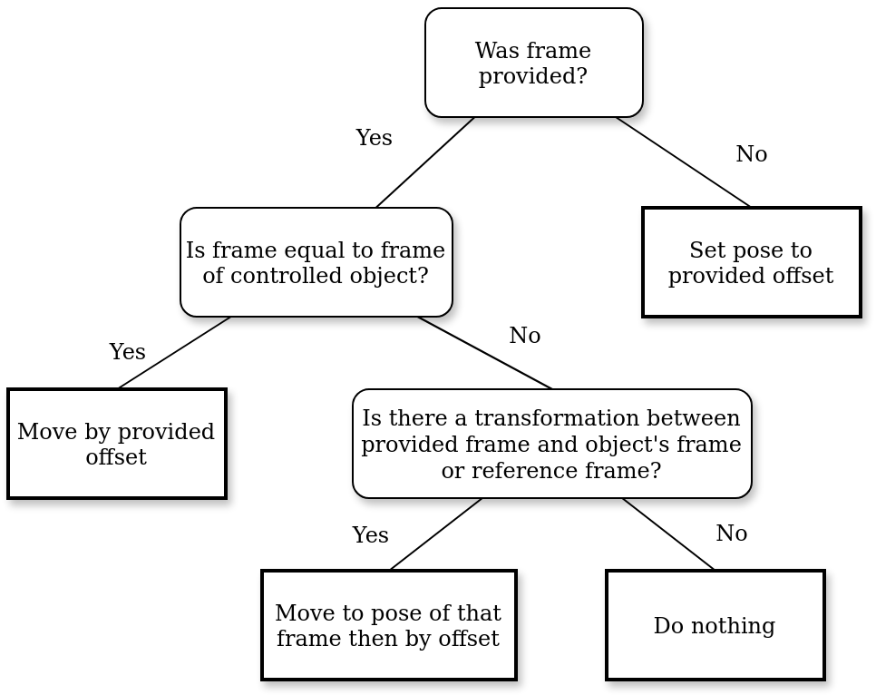

# Pose control

You can use the `ROS2PoseControl` component to control the robot or any arbitrary entity via ROS 2 position or tf2 messages.

## Adding component
The ROS2PoseControl can be attached to the entity you wish to control. 
This component will automatically disable physics component of controlled object and all it's children. 

## Configuration

After adding the component, you should see a window like this:

Firstly you will need to enable tracking and select the tacking mode.

Option | Description
--------| -----
Is Tracking | Turns this component on/off 
Tracking Mode | Select the tracking mode

You can select one of two tracking modes, and in later sections additional configuration options are described.

### TF2

In this mode component will listen to [tf2](https://docs.ros.org/en/humble/Tutorials/Intermediate/Tf2/Introduction-To-Tf2.html) messages and will set pose of the controlled object to the transform between specified target and reference frame.

Option | Description
--------| -----
Reference Frame | Frame of the origin 
Target Frame | Frame of the tractor (only used in mode TF2)

### Goal Pose

Option | Description
--------| -----
Reference Frame  | Frame of the origin 
Topic for goal message | Standard topic configuration (only used in mode PoseMessages)

In this mode component will listen to [`geometry_msgs::PoseStamped`](https://docs.ros2.org/latest/api/geometry_msgs/msg/PoseStamped.html) then it will resolve requests described in those messages in one of 4 ways as described in diagram bellow.

**Important** For mode where transformation between Reference frame and provided frame is computed [tf2](https://docs.ros.org/en/humble/Tutorials/Intermediate/Tf2/Introduction-To-Tf2.html) describing such transformation must be published before.

### Start Offset Tag

Option | Description
--------| -----
Start Offset Tag | If specified, the robot will controlled with the offset of the tagged entity

If this is set, then on the scene there should be exactly one object that has that tag. Then transform of this offset will be used as an origin for all transform. It is recommended to put object with Start Offset Tag at the location corresponding to the location of Reference frame in the simulation. If not set default world origin will be used.

### Lock Z Axis

Option | Description
--------| -----
Lock Z Axis | The Z axis will point up, preventing tilting

If enabled rotation of the controlled object will be always such that it's Z axis will point up. This will prevent tilting and excessive shaking if the data used to control is noisy. 

### Clamping to ground

Option | Description
--------| -----
Clamp to ground | The controlled entity will follow the collider under the robot.
Ground offset | The offset to the collider is applied when the `Clamp to ground` option is used.

This setting if enabled will force object to be always specified ground offset above the ground. This can be useful if the data was recorded on the slope and the simulation is on flat terrain or if data contains large drift in Z axis. 

## ImGui live options (for developers)

Using the ~ key, you can pull up ImGui options. There, you will see two toggles using which you can modify the `Is Tracking` and `Tracking mode` settings live.