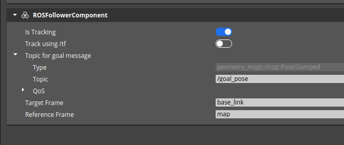

# Pose control

You can use the `ROS2PoseControl` component to control the robot or any arbitrary entity via ROS 2 position or tf messages.

## Adding component
The ROS2PoseControl can be attached to the entity you wish to control. 
If you would like to have collisions with a controlled robot, you can add a Rigid Body Component.
If so, set its mode to Kinematic.

## Configuration

After adding the component, you should see a window like this:

You can use this component in the following modes:

1. Using `PoseStamped` messages - the component listens to the selected topic of type [`geometry_msgs::PoseStamped`](https://docs.ros2.org/latest/api/geometry_msgs/msg/PoseStamped.html) and changes transform of the entity based on Pose received. The timestamp of the `PoseStamped` message is ignored and position is applied based on message arrival order.

2. Using the [tf2](https://docs.ros.org/en/humble/Tutorials/Intermediate/Tf2/Introduction-To-Tf2.html) messages - the component will look for the transform frame specified by you and use it to transform the entity.

Option | Description
--------| -----
Is Tracking | Turns this component on/off 
Tracking Mode | Select the tracking mode
Topic for goal message | Standard topic configuration (only used in mode PoseMessages)
Target Frame | Frame of the tractor (only used in mode TF2)
Reference Frame | Frame of the origin (only used in mode TF2)
Lock Z Axis | The Z axis will point up, preventing tilting
Start Offset Tag | If specified, the robot will controlled with the offset of the tagged entity
Clamp to ground | The controlled entity will follow the collider under the robot.
Ground offset | The offset to the collider is applied when the `Clamp to ground` option is used.

## ImGui live options

Using the ~ key, you can pull up ImGui options. There, you will see two toggles using which you can modify the `Is Tracking` and `Tracking mode` settings live.