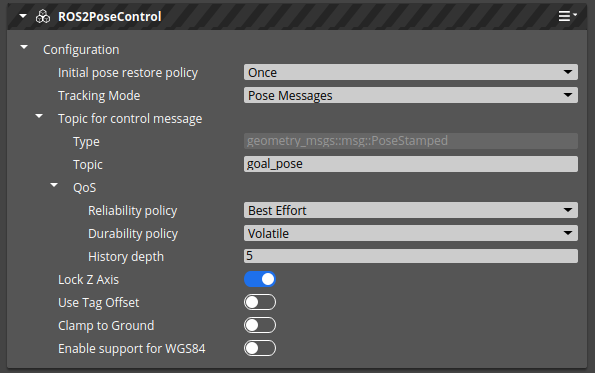

# Pose control

You can use the `ROS2PoseControl` component to control the robot or any arbitrary entity via ROS 2 position or TF messages.

## Adding component
The `ROS2PoseControl` can be attached to the entity you wish to control. 
If you would like to have collisions with a controlled robot, you can add a Rigid Body Component.
If so, set its mode to Kinematic.

## Configuration

After adding the component, you should see a window like this:



You can use this component in the following modes:

1. Using `PoseStamped` messages - the component listens to the selected topic of type [`geometry_msgs::PoseStamped`](https://docs.ros2.org/latest/api/geometry_msgs/msg/PoseStamped.html) and changes transform of the entity based on Pose received. The timestamp of the `PoseStamped` message is ignored and position is applied based on message arrival order.

2. Using the [tf2](https://docs.ros.org/en/humble/Tutorials/Intermediate/Tf2/Introduction-To-Tf2.html) messages - the component will look for the transform frame specified by you and use it to transform the entity.

Option                       | Description                                                                      |
-----------------------------|----------------------------------------------------------------------------------|
Initial pose restore policy  | Select the pose restoring policy                                                 |
Tracking Mode                | Select the tracking mode                                                         |
Topic for goal message       | Standard topic configuration (only used in mode PoseMessages)                    |
Target Frame                 | Frame of the controlled entity/prefab (only used in mode TF2)                    |
Reference Frame              | Frame of the origin (only used in mode TF2)                                      |
Lock Z Axis                  | The Z axis will point up, preventing tilting                                     |
Start Offset Tag             | If specified, the robot will be controlled with the offset of the tagged entity  |
Clamp to ground              | The controlled entity will follow the collider under the robot.                  |
Ground offset                | The offset to the collider is applied when the `Clamp to ground` option is used. |


## ImGui live options

Using the `[Home]` key, you can pull up ImGui options. There, you will see two toggles using which you can modify the `Is Tracking` and `Tracking mode` settings live.

## Initial pose restoring
The `ROS2PoseControl` component can manage and restore the local transforms of a controlled entity and all its children. This is useful when working with prefabs. When the component is activated, the initial local transforms are saved, defining the "initial pose," which represents the prefab's state immediately after spawning and before any physics interactions occur.
The component supports three restoring policies:
- `Never` - the initial pose will never be restored.
- `Once` - the initial pose will be restored once after the first goal pose request to the `ROS2PoseControl`.
- `Everytime` - the initial pose will be restored every time the `ROS2PoseControl` receives a goal pose request.

## Usage
To use the `ROS2PoseControl` add it to an entity, that should be controlled (e.g., the root of the prefab), configure it according to your preferences (see [Configuration](#configuration)) and run GameMode or GameLauncher.
### Tracking Mode Pose Messages
If `ROS2PoseControl` component is configured to track `Pose Messages`, use the topic that has been set in the `Topic for control message` to send `geometry_msgs::msg::PoseStamped` messages with the desired pose.
Example:
```bash
ros2 topic pub /goal_pose geometry_msgs/msg/PoseStamped '{header: {stamp: {sec: 0, nanosec: 0}, frame_id: ""}, pose: {position: {x: 10.0, y: 10.0, z: 40.0}, orientation: {x: 0.0, y: 0.0, z: 0.0, w: 1.0}}}' -1
```

### Tracking Mode TF
If `ROS2PoseControl` component is configured to track `TF`, ensure that the frames defined in the `Target Frame` and `Reference Frame` fields are present in the scene, rosbag, or other environment to which ROS 2 has access. Additionally, both frames must be part of the same TF tree; otherwise, the component will not be able to calculate a lookup transform.