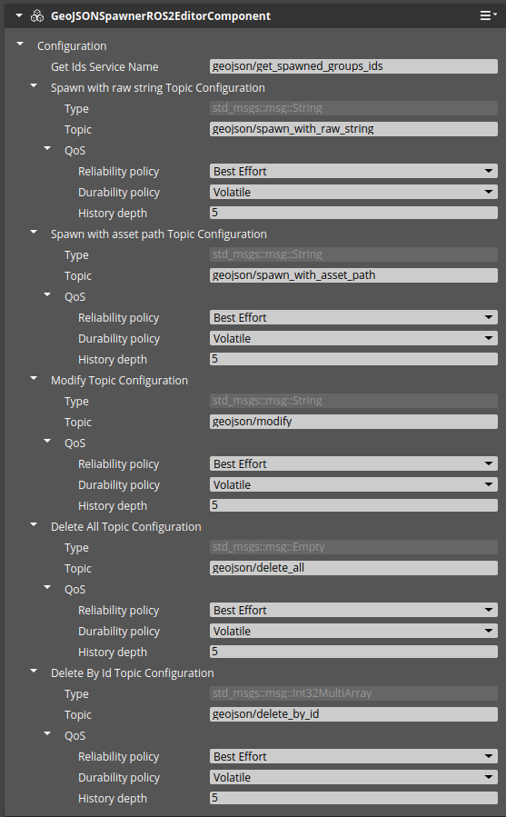

# robotec-o3de-tools

This repository is a collection of useful gems that are usable in O3DE.
Those gems are open source but refer to the license of every gem.
Note that this is not a "Canonical" part of O3DE - those gems are third-party contributions and are not tested against any particular version of the O3DE engine.

# RobotecRecordingTools
Toolset for joystick-controlled cameras and spline animation tools.

# SplineTools
The tools for expanding the usability of the Spline component in O3DE. 
It allows to:
 - Import spline from CSV file
 - Export spline to a CSV file
Having a CSV file formatted as :
```csv
x,y,z
0.000000,0.000000,0
0.698132,0.642788,0
1.396263,0.984808,0
2.094395,0.866025,0
2.792527,0.342020,0
3.490659,-0.342020,0
4.188790,-0.866025,0
4.886922,-0.984808,0
5.585054,-0.642788,0
6.283185,-0.000000,0
```

You can modify the Spline component in Editor.
Add SplineToolsEditorComponent next to the [Spline component](https://docs.o3de.org/docs/user-guide/components/reference/shape/spline/), locate your CSV file (it needs to exist as a source asset), and click the Load button.
If you switch `Local Coordinates` to true, the component will interpret coordinates as local to entity origin.


## Using geo-referenced data

The CSV file can contain the following columns: `lat`, `lon`, `alt` where every row contains the WGS-84 coordinate of the spline's node.
It can be loaded to a georeferenced level as explained in [Georeference section of O3DE documentation]
(https://development--o3deorg.netlify.app/docs/user-guide/interactivity/robotics/georeference/).
It is useful for visualizing paths, roads, and other things at the O3DE level.

# ROS2ScriptIntegration

Simple, but extremely useful tool that exposes ROS 2 subscription/publication to Script Canvas and LUA.
Refer to [readme](https://github.com/RobotecAI/robotec-o3de-tools/tree/main/Gems/ROS2ScriptIntegration#readme).

# RobotecSpectatorCamera

A component that allows to look at an entity from 3rd person perspective and to switch camera mode to the free flying mode (to switch mode press the `C` key). It also allows to enable/disable following the target's rotation and to add a vertical offset to change the `look at` point of the target entity.  


# RobotecWatchdogTools

Minimal dependency Gem that allows the setup runtime checks and prevents starting the Editor/GameLauncher if the requirements are not met
Refer to [readme](Gems/RobotecWatchdogTools/readme.md)

# Disable the main view

Deprecated, please use `-console-mode` switch available in o3de 2409. 
The description of said feature is in the original [PR](https://github.com/o3de/o3de/pull/18093).

# LevelModificationTools

The level modification tool contains a component called PrefabVariantEditorComponent. 
This component allows the change a variant of loaded prefab during game mode.
It exposes PrefabVariantRequestsBus to Script Canvas or LUA.

# SensorDebug

A tool that allows the adjusted frequency, activate and deactivate sensor during the game mode.

# Smoothing

Gem contains a smoothing component that will mimic the movement of an attached entity with the tracked entity. It offers multiple smoothing methods. It allows the lock Z axis to point up direction.
Useful for robots' movement smoothing.  


# CsvSpawner

Component that spawns prefabs using coordinates stored in CSV file. It supports XYZ format as well as WGS84 coordinate system.   


## Load object from CSV file

CSV file format for coordinates in XYZ system:
```csv
x	y	z	name
5.1	37	0	object_name
5.1	44	0	object_name
5.1	51	0	object_name
5.1	58	0	object_name
5.1	65	0	object_name
5.1	72	0	object_name
5.1	79	0	object_name

```

CSV file format for coordinates in WGS84 system:
```csv
alt	lat	lon	name
0	12.5896238486642	30.1930592634115	ball
0	12.5896467730289	30.1931152819367	ball
0	12.5896704915715	30.193170552104	    ball
0	12.5896945425591	30.1932257788658	ball
0	12.5897180240288	30.1932813604207	ball
0	12.5897414039641	30.1933370085065	ball
0	12.5897646831551	30.1933927129084	ball

```

# ExposeConsoleToRos

Simple utility Gem that exposes the O3DE console to ROS 2 topics.
It has two std_msgs/msg/String topics:
```
\o3de_console_out
\o3de_console_in
```
Currently `o3de_console_in` is usable only.
The gem functionality is available only in Profile/Debug.

# Pointcloud

A Gem that introduces point clouds to O3DE.
It offers:
- PointcloudFeatureProcessor with public API
- Pointcloud product asset 
- A public API for configuration (`PointcloudConfigurationBus`)

At this moment it accepts [PLY](https://en.wikipedia.org/wiki/PLY_(file_format)) as a source asset.

\
Pointcloud asset was obtained from [potree](https://github.com/potree/potree).

# ROS2PoseControl

A utility gem that introduces a way to control robots in simulation as puppets with Pose messages or TFs.

# GeoJSONSpawner

Component that spawns prefabs using coordinates stored in the GeoJSON format (either in a file or in a raw string). It supports WGS84 coordinate system.
This component supports spawning prefabs using GeoJSON stored in the file or stored in the raw string and passed via the ROS2 interface.


Configuration:
- Name - the name that is associated with the spawnable. This parameter is passed as `spawnable_name` in the GeoJSON message.
- Spawnable - prefab (spawnable) associated with the `Name`.
- Position std. dev - maximum value of the position standard deviation [metres].
- Rotation std. dev - maximum value of the rotation standard deviation [degrees].
- Scale std. dev - maximum value of the scale standard deviation.
- Place on terrain  - switch indicating whether the spawner should perform scene query raytrace to place the spawnable on the terrain (or any other collider).
- Raytrace starting height - WGS84 altitude. If `Place on terrain` is set to false, this value will be used as a fixed Z-axis value for the spawn. Otherwise the raytrace will start at this height (converted from WGS84 altitude to Z-axis value using the `GeoReference Level Editor Component`).
- Default seed  - seed for randomization.
- Show labels in Editor - switch to enable/disable labels in the Editor for spawned prefabs.

To get all the necessary information, the supported GeoJSON format is extended by a two additional fields (although this format is still correct with a GeoJSON standard) - `spawnable_name` and `id`. The `spawnable_name` is used to match spawn coordinates to a prefab name in a `Spawnable Asset Configuration`. The `id` is used to delete/modify the spawned object.
Example of supported GeoJSON:
```
{
  "type": "FeatureCollection",
  "features": [
    {
      "type": "Feature",
      "properties": {
        "spawnable_name": "ball",
        "id": 0
      },
      "geometry": {
        "type": "Point",
        "coordinates": [35.19412345678901, 32.58987654321098]
      }
    },
    {
      "type": "Feature",
      "properties": {
        "spawnable_name": "ball",
        "id": 1
      },
      "geometry": {
        "type": "MultiPoint",
        "coordinates": [
          [12.19423456789012, 21.58976543210987],
          [12.19454321098765, 21.58923456789012]
        ]
      }
    }
  ]
}

```

# GeoJSONSpawnerROS2

Gem provides a component that connects GeoJSONSpawner with ROS 2. This component provides 4 topics and 1 service that allows to control GeoJSONSpawner with ROS 2 messages.



Topics:
- `geojson/spawn_with_asset_path [std_msgs::msg:String]` - topic that allows to spawn entities using a passed path to asset with GeoJSON.
- `geojson/spawn_with_raw_string [std_msgs::msg:String]` - topic that allows to spawn entities using a passed raw string with a GeoJSON.
- `geojson/modify [std_msgs::msg::String]`  - topic that allows to modify spawned entities using the id passed with a spawn request. Usage example:
Lets suppose that user spawned prefabs using such GeoJSON:
```
{
  "type": "FeatureCollection",
  "features": [
    {
      "type": "Feature",
      "properties": {
        "spawnable_name": "ball",
        "id": 0
      },
      "geometry": {
        "type": "Point",
        "coordinates": [35.19412345678901, 32.58987654321098]
      }
    },
    {
      "type": "Feature",
      "properties": {
        "spawnable_name": "ball",
        "id": 1
      },
      "geometry": {
        "type": "MultiPoint",
        "coordinates": [
          [12.19423456789012, 21.58976543210987],
          [12.19454321098765, 21.58923456789012]
        ]
      }
    }
  ]
}
```
Suppose the user wants to move the Feature Object assigned to ID 0. To do this, remove the Feature Object with ID 1 from the original json, then apply the necessary corrections to the coordinates of the Feature Object with ID 0 and send the GeoJSON thus prepared to the topic `geojson/modify`.
```
{
  "type": "FeatureCollection",
  "features": [
    {
      "type": "Feature",
      "properties": {
        "spawnable_name": "ball",
        "id": 0
      },
      "geometry": {
        "type": "Point",
        "coordinates": [135.19412345678901, 132.58987654321098]
      }
    }
  ]
}

```
- `geojson/delete_all [std_msgs::msg::Empty]` - topic that despawns all entities spawned with GeoJSONSpawner.
- `geojson/delete_by_id [std_msgs/msg/Int32MultiArray]`  - topic that despawns all entities associated with a given ids.

Service:
`geojson/get_spawned_groups_ids [std_srvs/srv/Trigger]` - service that returns all spawned ids together with the number of prefabs associated with each id.

## Usage examples:

### Spawn with the raw string
```
ros2 topic pub /geojson/spawn_with_raw_string std_msgs/msg/String "data: '{
  \"type\": \"FeatureCollection\",
  \"features\": [
    {
      \"type\": \"Feature\",
      \"properties\": {
        \"spawnable_name\": \"ball\",
        \"id\": 0
      },
      \"geometry\": {
        \"type\": \"Point\",
        \"coordinates\": [
          [12.194254455922405, 21.58976758326028]
        ]
      }
    }
  ]
}'" --once
```

### Spawn with asset path
```
ros2 topic pub /geojson/spawn_with_asset_path std_msgs/msg/String "{data: Assets/GeoJSON/output.json}" --once
```

### Modify
This request adds 3 more `ball` spawnables to the group with ID 0.
```
ros2 topic pub /geojson/modify std_msgs/msg/String "data: '{
  \"type\": \"FeatureCollection\",
  \"features\": [
    {
      \"type\": \"Feature\",
      \"properties\": {
        \"spawnable_name\": \"ball\",
        \"id\": 0
      },
      \"geometry\": {
        \"type\": \"MultiPoint\",
        \"coordinates\": [
          [12.194254455922405, 21.58976758326028],
          [12.194254455922415, 21.58976758326018],
          [12.194254455922425, 21.58976758326008],
          [12.194254455922435, 21.58976758326098]
        ]
      }
    }
  ]
}'" --once
```

### Delete by id
```
ros2 topic pub /geojson/delete_by_id std_msgs/msg/Int32MultiArray "{data: [0]}" --once
```

### Delete all
```
ros2 topic pub /geojson/delete_all std_msgs/msg/Empty "{}" --once
```

### Get spawned groups ids
```
ros2 service call /geojson/get_spawned_groups_ids std_srvs/srv/Trigger
```

# ImGuizmo

This gem brings gizmo (with some simple API) to be used in game mode.
It is gemification of existing ImGui extension called [ImGuizmo](https://github.com/CedricGuillemet/ImGuizmo).
This gem comes with only one system component that is active only in game mode.
To test this gizmo, activate gem and type in O3DE console (in gamelauncher):
```
imguizmo_acquire
imguizmo_show 0
```

There is an API to work with multiple gizmos using handle.
Refer to script canvas example below:


*Note* Only one gizmo can be rendered at the time!

# FPSProfiler
This gem provides a tool to collect statistics in the game mode of the FPS, CPU and GPU into `csv` file.

The Profiler has a EBus which can control profiling in runtime (start/stop/reset), save profiled data, change save path, access current frame memory data or fps (avg, min, max).
It is also provided with a set of notification functions, making it highly customizable for end user.

## Setup
To start using the profiler, add a `FPSProfiler` to Level entity.


| Variable Name             | Description                                                                                |
|---------------------------|--------------------------------------------------------------------------------------------|
| Csv Save Path             | Path where collected data will be saved.                                                   |
| Auto Save                 | Enable auto save.                                                                          |
| Auto Save At Frame        | Auto saves collected data at selected frame occurrence.                                    |
| Timestamp                 | Applies timestamp Year-Month-Day-Hour-Minutes to file name. Let's you save multiple files. |
| Near Zero Precision       |                                                                                            |
| Save FPS Data             |                                                                                            |
| Save CPU Data             |                                                                                            |
| Save GPU Data             |                                                                                            |
| Show FPS                  |                                                                                            |
| Profile On Game Start     |                                                                                            |

## Saved File Example
| Frame | FrameTime  | CurrentFPS | MinFPS    | MaxFPS  | AvgFPS  | CpuMemoryUsed | GpuMemoryUsed |
|-------|------------|------------|-----------|---------|---------|---------------|---------------|
| 1     | 5347.2783  | 0.00       | MAX_FLOAT | 0.00    | 0.00    | 1349.42       | 1752.12       |
| 2     | 0.4207     | 2.38       | 2.38      | 2.38    | 1.19    | 1375.50       | 2999.38       |
| 3     | 0.1934     | 5.17       | 2.38      | 5.17    | 2.52    | 1400.49       | 2963.44       |

